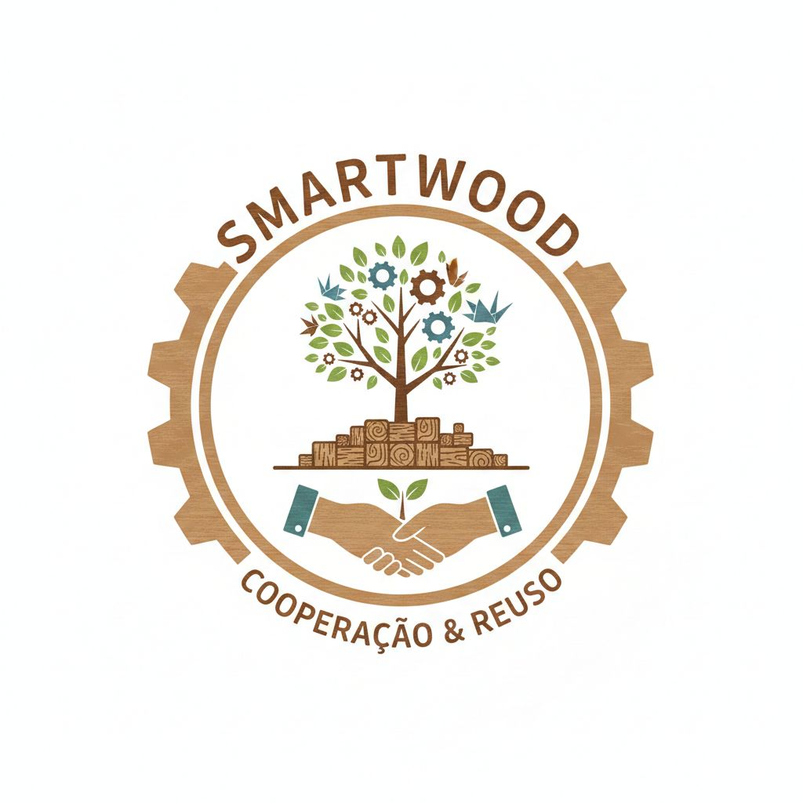

  

# SmartWood
Aplicativo voltado para o descarte inteligente e reutilização de materiais, promovendo sustentabilidade e economia circular.”
## Objetivo
Conectar pessoas e empresas interessadas na reutilização de materiais como madeira, vidro e outros resíduos reutilizáveis.

## Problema
Segundo a ABREMA, o Brasil produz mais de 81 milhões de toneladas de lixo por ano, e grande parte ainda recebe destinação inadequada.

## ODS utilizadas
- ODS 9
- ODS 11
- ODS 12
- ODS 15
- ODS 17

## Estrutura do Projeto
- Banner
- Artigo
- Landing Page
- Protótipo Base44
- Trello

## Integrantes
- Luis Gustavo Ferreira Mano, Gustavo Pimentel, Bruno Soares, Enzo Gabriel Galmassi e Leonardo Leão.
